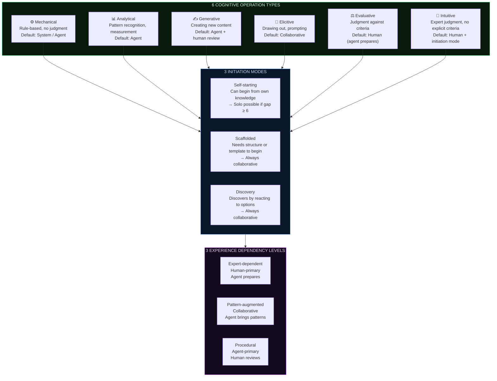

# Start with a high level overview of the new version of CAWDP (phase headings with subsections). Then Give me markdown for the charts I can use with Mermaid.

Here is the full overview and Mermaid markdown.

***

# CAWDP v2.3 — High-Level Overview

## Foundational Concepts

Before any phase begins, four principles govern the entire methodology:[^1]

- **Identity-First Design** — Five questions (Q1–Q5) answered before any capability discussion; everything cascades from identity
- **The Possibility Orientation Principle** — Each phase has a legitimate stance (pure possibility → pure constraint); getting the stance wrong corrupts downstream decisions
- **The Boundary is the Product** — Every authority boundary traces to a specific failure mode; the boundary is a failure-prevention mechanism, not a capability limit
- **Human-Agent Complementarity** — The agent prepares judgment; the human makes judgment; the system enforces the boundary between them

***

## 🔭 Discovery Diamond

### P0 · Purpose \& Vision — IMAGINE

*Stance: Pure possibility*

- **Human Origin** — Trace the workflow back to a specific human need or desire (new in v2.0)
- **Stakeholder Map** — Identify direct actors, direct beneficiaries, indirect stakeholders, governing parties, power asymmetries, and stakeholder tensions (new in v2.0)
- **Five Identity Questions** — Q1 what it does · Q2 orientation · Q3 what would violate it · Q4 what a failed run looks like · Q5 the hardest boundary moment
- **Target State Vision** — Four dimensions: Workflow / Specification / Human / Ecosystem, each with 5+ testable characteristics
- *Quality gate: No feasibility language. Q5 is a specific scenario, not an abstract statement.*

### P1 · Output Specification — SPECIFY

*Stance: Formed possibility*

- **29 Outputs** across 8 groups: Identity · Contracts · Behaviour · Verification · Implementation · Human Artefacts · Ecosystem · Operational
- **Schema + dependency + quality gate** for every output — typed, not prose
- **Recipient anchoring** — every output traces to a named stakeholder group (new in v2.0)
- **Output Dependency Map** — directed acyclic graph; circular dependencies are design errors
- *Quality gate: Every output has schema, dependencies, quality gate, and traces to a P0 characteristic.*

### P2 · Backcasting — TRACE

*Stance: Transitional*

- **Dependency tracing** — work backward from each output to identify required inputs
- **Input requirement fields** — id · type (external/internal) · criticality · satisfaction mode · source phase
- **Gap detection** — Missing input · Circular dependency · Orphan output · Critical path gap · Quality gate gap · **Governance gap** (new in v2.0 — input exists but controlled by a party outside the workflow's authority)
- *Quality gate: All final deliverable dependencies trace to external inputs. No circular dependencies. Every gap has a resolution plan.*

***

## 🚦 Stage 1 Gate

*Contract sections 1–14 complete · Output Specifications approved*

***

## 🏗️ Structure Diamond

### P3 · Task Decomposition — DECOMPOSE

*Stance: Constructive*

- **Task specification fields** — id · description · cognitive type · initiation mode · input requirements · output produced · failure mode · dependency chain
- **Six cognitive operation types** — Mechanical · Analytical · Generative · Elicitive · Evaluative · Intuitive — each with default actor and initiation mode
- **Three initiation modes** — Self-starting · Scaffolded · Discovery
- **Three experience dependency levels** — Expert-dependent · Pattern-augmented · Procedural
- **Decomposition Quality Standard** — five properties per task: single cognitive operation · clear artefact · explicit initiation mode · explicit authority boundary · explicit failure mode
- **Conflation Test** — six yes/no questions; any "no" = conflated task, must split
- **Failure mode + stakeholder group + blast radius** — every failure mode now names who bears the consequence (new in v2.0)

### P4 · Capability Allocation — ALLOCATE

*Stance: Constructive*

- **Ternary HAS matrix** — Human / Agent / System allocation per task
- **Pass 1** — Capability gap score (1–10); gap ≥ 6 enables solo agent allocation
- **Pass 2** — Five adjustment factors: Cold Start · Experience · Discovery · Prep Value · Reversibility
- **Pass 3** — Stakeholder Trust Assessment: does this allocation risk being perceived as unfair, opaque, or emotionally burdensome? (new in v2.0)
- **Human-Primary / Human-Only principle** — identity, purpose, and boundary tasks are collaborative by default

### P5 · Event Storming — STRESS-TEST

*Stance: Constructive/Adversarial*

- **Domain events** — things that happen in the world that the workflow must respond to
- **Failure events** — authority boundary exceeded · output fails verification · cost budget exhausted · capability gap detected
- **Recovery paths** — per failure event: what the system does, what the human does, what the state becomes
- **Stakeholder failure events** (new in v2.0) — output delivered but unusable · workflow completed but indirect stakeholders harmed · trust between stakeholders degraded · workflow aborted leaving a stakeholder worse off
- **Recovery actions for stakeholder failures** include communication and relationship repair, not just state restoration

***

## 🚦 Stage 2 Gate

*Backcasting Output accepted · Input Specification approved · Contract sections 15–17 complete*

***

## ⚙️ Realisation Diamond

### P6 · System Architecture — ARCHITECT

*Stance: Structural*

- **Composition decision** — Single Agent / Team / Workflow pattern
- **Workflow stages** — define the pipeline, flow between stages, human gates
- **Orchestration design** — communication, context flow, fallback tiers (graceful degradation · alternative path · human escalation)
- **Template architecture** — 7 template types: Input · Output · Handoff · Verification · Decision · Feedback · Escalation
- **FMEA** — Severity · Occurrence · Detection · RPN per failure mode
- **Manifest check + registration** (new in v2.0) — check shared manifest before designing data structures; register outputs that may be consumed by other workflows; declare `consumes_from` and `produces_for` dependency contracts

### P7 · Participant Design — DESIGN

*Stance: Concrete*

- **10-section participant specification** — Identity · Boundaries · Task Map · Knowledge · Capabilities · Behaviour · Verification · Failure Recovery · Lifecycle · Governance
- **Section 11: Actor Experience** (new in v2.0) — effort level · typical challenges · sustainability assessment · friction reduction opportunities · capability build/degrade over time
- **Five-class taxonomy** — Extractor · Measurer · Assessor · Generator · Aggregator — each with characteristic authority boundary and null-state output
- **Three enforcement regimes** per boundary — Regime 1 Declare · Regime 2 Detect · Regime 3 Prevent (target: Regime 3 wherever structurally feasible)
- **Progressive autonomy** — four levels per dimension: Shadow · Advisory · Supervised · Autonomous — with promotion criteria
- **Two-category harm assessment** — Direct output harm · Indirect data harm
- **Epistemic metadata profile** — six fields on every output: Confidence · Provenance · Assumptions · Limitations · Recency · Uncertainty
- **Decision presentation pattern** — 2–4 structured options with benefits and risks; human can always provide custom option

### P8 · Contract Formalization — FORMALIZE

*Stance: Pure constraint*

- **10 contract primitives** — one contract per task; actor-agnostic (applies symmetrically to Human / Agent / System)
- **Partial completion model** (new in v2.0) — Better / Neutral / Worse than before — if Worse, mandatory human notification and defined remediation path
- **Revert model** — Full revert · Partial revert · Non-revertible (each with different enforcement obligations)
- **Unenforceable Elements Register** — documents every specification element at Regime 1 or 2; records redesign paths
- **Pattern-First Entry** — five core patterns pre-fill 40–70% of the contract: Signal Detector · Multi-Lens Analyst · Discovery Explorer · Learning Scaffold · Review Partner
- **Contract depth scaling** — depth scales with participant class and autonomy level; Extractor in Shadow mode gets a shallow contract

### P9 · Human Experience Design — EMPATHIZE

*Stance: Partially reopens possibility*

- **Cognitive Load Budget** — adaptive; six factors: base capacity · domain weight · user experience · session sequence · decision complexity
- **System Empowerment Assessment** — five levels: Constraining · Informing · Enabling · Amplifying · Liberating (target: Amplifying or Liberating)
- **Override mechanisms** — five types per human gate: Accept · Modify · Reject · Escalate · Pause
- **Actor and end-user experience design** — reopens possibility for both the workflow performer and the end recipient (expanded in v2.0)
- **Progressive disclosure levels** — Quick Start · Practitioner · Architect · Contributor

### P10 · Validation \& Iteration — VERIFY → EVOLVE

*Stance: Spirals back*

- **Testable hypotheses** — minimum 3 per workflow; format: claim · measurement · success criteria · failure criteria · action on fail
- **Progressive autonomy deployment** — four stages per dimension with promotion criteria and override rate thresholds
- **Health monitoring metrics** — Schema compliance · Boundary compliance · Cost variance · Specification freshness · Verification pass rate · Override rate · Output quality
- **EVOLVE triggers** — guard violation rate · unenforceable elements accumulating · contract derivation cost · revert rate · human override rate · capability drift · specification aging · new failure mode discovered
- **Two modes** — DESIGN mode (P0→P10, new workflow) · EVOLVE mode (P10→P0, improvement cycle); the journey is a spiral

***

***

# Mermaid Markdown

Three charts are provided: the full phase sequence, the workflow contract section flow, and the possibility orientation gradient.

***

## Chart 1 — Full Phase Sequence

```mermaid
flowchart TD
    subgraph D["🔭 DISCOVERY DIAMOND"]
        P0["**P0 · PURPOSE & VISION**
        IMAGINE · Pure possibility
        ─────────────────────
        Human Origin + Stakeholder Map
        Five Identity Questions Q1–Q5
        Target State Vision (4 dims)"]

        P1["**P1 · OUTPUT SPECIFICATION**
        SPECIFY · Formed possibility
        ─────────────────────
        29 Outputs across 8 groups
        Schema · Dependency · Quality gate
        Recipient anchored to stakeholder"]

        P2["**P2 · BACKCASTING**
        TRACE · Transitional
        ─────────────────────
        Trace outputs → inputs
        6 gap types incl. Governance gap
        Input criticality + satisfaction mode"]
    end

    subgraph S["🏗️ STRUCTURE DIAMOND"]
        P3["**P3 · TASK DECOMPOSITION**
        DECOMPOSE · Constructive
        ─────────────────────
        6 cognitive types · 3 initiation modes
        Conflation Test (6 checks)
        Failure mode → stakeholder + blast radius"]

        P4["**P4 · CAPABILITY ALLOCATION**
        ALLOCATE · Constructive
        ─────────────────────
        Ternary HAS matrix (Human/Agent/System)
        Pass 1 gap · Pass 2 adjustments
        Pass 3 Stakeholder Trust Assessment"]

        P5["**P5 · EVENT STORMING**
        STRESS-TEST · Adversarial
        ─────────────────────
        Domain + failure events + recovery paths
        Stakeholder failure events (new)
        Relationship repair recovery actions"]
    end

    subgraph R["⚙️ REALISATION DIAMOND"]
        P6["**P6 · SYSTEM ARCHITECTURE**
        ARCHITECT · Structural
        ─────────────────────
        Pipeline · Orchestration · FMEA
        Manifest check + registration (new)
        Fallback: degrade → alternate → escalate"]

        P7["**P7 · PARTICIPANT DESIGN**
        DESIGN · Concrete
        ─────────────────────
        11-section spec (incl. Actor Experience)
        5-class taxonomy · 3 enforcement regimes
        Progressive autonomy · Epistemic metadata"]

        P8["**P8 · CONTRACT FORMALIZATION**
        FORMALIZE · Pure constraint
        ─────────────────────
        10 actor-agnostic primitives
        Partial completion model Better/Neutral/Worse
        Unenforceable Elements Register"]

        P9["**P9 · HUMAN EXPERIENCE DESIGN**
        EMPATHIZE · Reopens possibility
        ─────────────────────
        Cognitive load · Override mechanisms
        System Empowerment (target: Amplifying)
        Actor + end-user experience design"]

        P10["**P10 · VALIDATION & ITERATION**
        VERIFY → EVOLVE · Spirals back
        ─────────────────────
        Min 3 hypotheses · Health monitoring
        Progressive autonomy deployment
        EVOLVE triggers → back to P0"]
    end

    G1{{"🚦 STAGE 1 GATE
    Sections 1–14 · Output Specs approved"}}

    G2{{"🚦 STAGE 2 GATE
    Backcasting accepted · Sections 15–17"}}

    P0 --> P1 --> P2 --> G1
    G1 --> P3 --> P4 --> P5 --> G2
    G2 --> P6 --> P7 --> P8 --> P9 --> P10
    P10 -.->|"EVOLVE spiral"| P0

    style D fill:#091728,stroke:#4a9eff,color:#c8dcf8
    style S fill:#091a0d,stroke:#4aff9e,color:#c8f8d8
    style R fill:#130a1e,stroke:#d44aff,color:#e8d0f8
    style G1 fill:#1e1a00,stroke:#ffd44a,color:#fff5cc
    style G2 fill:#1e1a00,stroke:#ffd44a,color:#fff5cc
```

***

## Chart 2 — Workflow Contract Sections Flow

```mermaid
flowchart LR
    subgraph S1["STAGE 1 — Discovery"]
        direction TB
        C1["§1 Identity
        name · class · shape · rigour"]
        C2["§2 Human Origin
        human_goal · trigger · current state"]
        C3["§3 Stakeholder Map
        actors · beneficiaries · tensions"]
        C4["§4 Purpose & Value
        purpose · value · worth"]
        C5["§5 Stakeholder Harm
        harm_if_fails · blast_radius"]
        C6["§6 Completion Criteria
        definition_of_done · partial_value"]
        C7["§7 Failure Modes
        known_failures · abortion_triggers"]
        C8["§8 Risk Profile
        risk_level · actor_capability_risk"]
        C9["§9 Non-Completion Costs
        cost_per_stakeholder · urgency"]
        C10["§10 Visibility & Governance
        accountable_role · audit_trail"]
        C11["§11 Relationships
        depends_on · manifest contracts"]
        C12["§12 Assumptions
        spec_assumptions · confidence"]
        C13["§13 Knowledge & Learning
        actor_capability_effect"]
        C14["§14 Time & Recurrence
        duration · recurrence · pauses"]
    end

    subgraph S2["STAGE 2 — Structure"]
        direction TB
        C15["§15 CAWDP Artefacts
        backcasting · P0 identity answers"]
        C16["§16 Task Structure
        steps · paths · sub-workflows"]
        C17["§17 Actor Experience
        experience · sustainability · friction"]
    end

    subgraph SYS["SYSTEM MANAGED"]
        C18["§18 Approval Records
        approver · timestamp · conditions"]
    end

    C1 --> C2 --> C3 --> C4 --> C5
    C5 --> C6 --> C7 --> C8 --> C9
    C9 --> C10 --> C11 --> C12 --> C13 --> C14

    C14 -->|"Stage 1 Gate"| C15
    C15 --> C16 --> C17
    C17 -->|"Stage 2 Gate"| C18

    style S1 fill:#091728,stroke:#4a9eff,color:#c8dcf8
    style S2 fill:#091a0d,stroke:#4aff9e,color:#c8f8d8
    style SYS fill:#1e1a00,stroke:#ffd44a,color:#fff5cc
```

***

## Chart 3 — Possibility Orientation Gradient

```mermaid
flowchart LR
    PP["🔓 PURE POSSIBILITY
    P0 — IMAGINE
    What could be?"]

    FP["FORMED POSSIBILITY
    P1 — SPECIFY
    What must exist?"]

    TR["TRANSITIONAL
    P2 — TRACE
    How do outputs depend on inputs?"]

    CO["CONSTRUCTIVE
    P3 · P4 · P5
    DECOMPOSE · ALLOCATE · STRESS-TEST
    What work? Who does it? What fails?"]

    ST["STRUCTURAL
    P6 — ARCHITECT
    How do parts compose?"]

    CN["CONCRETE
    P7 — DESIGN
    What is each participant?"]

    PC["🔒 PURE CONSTRAINT
    P8 — FORMALIZE
    What must the system enforce?"]

    RP["↩ REOPENS
    P9 — EMPATHIZE
    How does enforcement feel?"]

    SP["🔄 SPIRALS BACK
    P10 — EVOLVE
    Does it work? What evolves?"]

    PP --> FP --> TR --> CO --> ST --> CN --> PC --> RP --> SP
    SP -.->|"back to P0"| PP

    style PP fill:#091728,stroke:#4a9eff,color:#c8dcf8
    style FP fill:#091f2e,stroke:#4a9eff,color:#c8dcf8
    style TR fill:#0b1e1a,stroke:#4adfae,color:#c8f0e0
    style CO fill:#091a0d,stroke:#4aff9e,color:#c8f8d8
    style ST fill:#130a1e,stroke:#d44aff,color:#e8d0f8
    style CN fill:#180c22,stroke:#d44aff,color:#e8d0f8
    style PC fill:#1e0e28,stroke:#d44aff,color:#e8d0f8
    style RP fill:#1a1020,stroke:#ff9ef4,color:#f8e8ff
    style SP fill:#0d1117,stroke:#888888,color:#cccccc
```

***

## Chart 4 — Task Cognitive Types (P3 Reference)

⁂

[^1]: paste.txt

